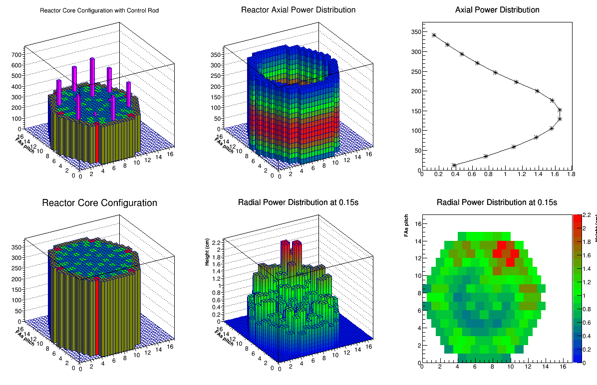

# cpp_data_visualization
visualization of output data of PARCS (computer code for nuclear reactor) using ROOT (c++ framework https://root.cern.ch/) 
This analysis was performed in 2015, with ROOT version 5.2 

to run this code, you need to install ROOT (cern) 
 > .L showCoreConfig.C 
 > test()

for new ROOT version, you might need to modify the code to run it.

Algorithm used in this code:  
 - read data by condition 
 - clustering 

Input data in text format 
output of analysis: 
(see figures and video in folder output_Data/output_10percent and output_Data/output_100percent/) 

video data at 10% power: 

video data at 100% power: 
